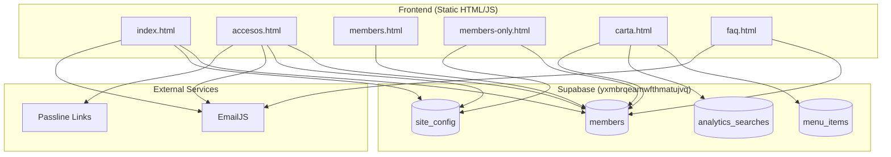

# Reporte de Estado: Midnight Club 2

> **Fecha de Auditoría:** 2026-01-23  
> **Proyecto:** midnightclub 2 (Frontend estático + Supabase)  
> **Autor del Reporte:** Agente Antigravity  
> **Tipo:** Auditoría técnica + Arquitectura

---

## 1. Resumen Ejecutivo

Midnight Club 2 es una **aplicación web estática** (HTML/CSS/JS puro) diseñada como portal de membresías para un club nocturno. Consta de **14 archivos** en estructura plana (sin modularización), conectada a un proyecto Supabase externo (`yxmbrqeamwfthmatujvq`) que **no está en la lista de proyectos accesibles** del MCP actual.

El sistema implementa: login de miembros con ID/contraseña, solicitud de membresía, catálogo de accesos/tickets, carta de tragos, y FAQ. Incluye PWA básica. La arquitectura es **monolítica y acoplada** con lógica duplicada en múltiples archivos (login, recovery).

**Estado general:** Funcional pero con riesgos críticos de seguridad y escalabilidad. Requiere estabilización urgente de seguridad antes de agregar funcionalidades.

---

## 2. Objetivo del Sistema

Midnight Club 2 debe lograr en producción:

1. **Portal público de acceso a tickets** (integración Passline/externa)
2. **Sistema de membresías** con beneficios exclusivos (accesos bonificados, VIP)
3. **Carta digital** de productos con precios dinámicos
4. **PWA instalable** para experiencia mobile-first
5. **Administración básica** via configuración en base de datos (`site_config`)

---

## 3. Inventario Actual

### 3.1 Módulos/Pantallas Existentes

| Archivo             | Propósito                            | Rol            | Estado     |
| ------------------- | ------------------------------------ | -------------- | ---------- |
| `index.html`        | Landing page + Login modal           | Público/Member | ✅ OK      |
| `accesos.html`      | Selector de tickets públicos + Login | Público/Member | ✅ OK      |
| `members.html`      | Formulario de solicitud de ID        | Público        | ✅ OK      |
| `members-only.html` | Dashboard de miembro logueado        | Member         | ✅ OK      |
| `carta.html`        | Catálogo de tragos con precios       | Público        | ✅ OK      |
| `faq.html`          | Preguntas frecuentes (acordeón)      | Público        | ✅ OK      |
| `legales.html`      | Términos y condiciones               | Público        | ✅ OK      |
| `success.html`      | Confirmación de solicitud enviada    | Público        | ✅ OK      |
| `styles.css`        | Estilos globales                     | -              | ⚠️ Parcial |
| `sw.js`             | Service Worker (PWA cache)           | -              | ⚠️ Parcial |
| `manifest.json`     | Configuración PWA                    | -              | ✅ OK      |

**Leyenda:** ✅ OK = Funciona correctamente | ⚠️ Parcial = Funciona con issues menores | ❌ Roto = No funciona

### 3.2 Base de Datos (Tablas Detectadas)

> [!WARNING]
> **No verificado en BD real** - El proyecto Supabase `yxmbrqeamwfthmatujvq` no está accesible via MCP.
> Las siguientes tablas fueron inferidas del código frontend.

| Tabla                | Propósito                        | Columnas Detectadas                                                                            | Riesgo                                   |
| -------------------- | -------------------------------- | ---------------------------------------------------------------------------------------------- | ---------------------------------------- |
| `members`            | Miembros del club                | `id`, `member_id`, `nombre`, `nacimiento`, `instagram`, `telefono`, `email`, `access_password` | 🔴 **CRÍTICO** - Password en texto plano |
| `site_config`        | Configuración dinámica del sitio | `key`, `value`, `url`, `is_active`                                                             | 🟡 Medio - Sin validación de tipos       |
| `menu_items`         | Productos de la carta            | `id`, `name`, `description`, `price`, `category`, `subcategory`, `is_active`, `is_pick`        | 🟢 Bajo                                  |
| `analytics_searches` | Registro de búsquedas            | `term`, `results_count`                                                                        | 🟢 Bajo                                  |

### 3.3 Integraciones Actuales

| Integración            | Estado         | Notas                                                     |
| ---------------------- | -------------- | --------------------------------------------------------- |
| **Supabase** (Backend) | ✅ Conectado   | Proyecto: `yxmbrqeamwfthmatujvq`                          |
| **EmailJS**            | ✅ Conectado   | Servicio: `service_j7h80jk`, Template: `template_kuhhdwl` |
| **Passline**           | 🔗 Via enlaces | Solo redirección externa, no integración API              |
| **Google Fonts**       | ✅ Activo      | Inter, Outfit                                             |

---

## 4. Hallazgos (Lista Priorizada)

### 🔴 Severidad ALTA

| #   | Hallazgo                                 | Evidencia                            | Impacto                                                       | Arreglo Recomendado                                 |
| --- | ---------------------------------------- | ------------------------------------ | ------------------------------------------------------------- | --------------------------------------------------- |
| 1   | **Contraseñas en texto plano**           | `members.html:190`, `index.html:164` | Compromiso total de cuentas en caso de leak                   | Migrar a Supabase Auth o hashear contraseñas        |
| 2   | **Sin RLS verificable**                  | Código JS hace queries directas      | Cualquier usuario puede leer/escribir toda la tabla `members` | Implementar RLS en Supabase                         |
| 3   | **Autenticación basada en localStorage** | `members-only.html:14-18`            | Sesión falsificable con DevTools                              | Usar tokens JWT + validación server-side            |
| 4   | **Recovery genera password en cliente**  | `index.html:189`                     | Password predecible, visible en DevTools                      | Mover lógica a Edge Function o RPC                  |
| 5   | **API Keys expuestas en código**         | Todos los archivos `.html`           | Credenciales visibles públicamente                            | Aunque son anon keys, confirmar que RLS esté activo |

### 🟡 Severidad MEDIA

| #   | Hallazgo                                   | Evidencia                                                      | Impacto                                        | Arreglo Recomendado                        |
| --- | ------------------------------------------ | -------------------------------------------------------------- | ---------------------------------------------- | ------------------------------------------ |
| 6   | **Lógica de login duplicada**              | `index.html`, `accesos.html`, `faq.html`, `carta.html`         | Mantenimiento difícil, bugs por inconsistencia | Extraer a módulo JS compartido             |
| 7   | **URLs hardcodeadas**                      | `members-only.html:16,244,252` → `https://midnightclub.com.ar` | Problemas en dev/staging                       | Usar variable de entorno o config          |
| 8   | **Service Worker con path inválido**       | `sw.js:4` → `/https://midnightclub.com.ar`                     | Error de cache, afecta PWA offline             | Corregir a `/` o `index.html`              |
| 9   | **No hay validación de email en recovery** | `index.html:183`                                               | Solo verifica que contenga `@`                 | Usar regex completo o validación HTML5     |
| 10  | **Precio cash calculado en cliente**       | `carta.html:320-321`                                           | Manipulable por usuario                        | Mover cálculo a backend o verificar en POS |

### 🟢 Severidad BAJA

| #   | Hallazgo                              | Evidencia                                               | Impacto                         | Arreglo Recomendado                  |
| --- | ------------------------------------- | ------------------------------------------------------- | ------------------------------- | ------------------------------------ |
| 11  | **CSS con media query sin valor**     | `styles.css:127` → `@media (min-width: px)`             | Regla CSS inválida, ignorada    | Agregar valor (ej: `1400px`)         |
| 12  | **Estilos duplicados**                | `styles.css:314-367` repite bloques de `#mc-login-gate` | CSS bloat                       | Consolidar en único bloque           |
| 13  | **No hay SEO meta tags**              | Todos los HTML                                          | Menor visibilidad en buscadores | Agregar meta description, Open Graph |
| 14  | **Fecha hardcodeada en members.html** | Formato `DD/MM/AAAA` sin i18n                           | Limitación regional             | Considerar usar date picker nativo   |

---

## 5. Inconsistencias y Deuda Técnica

### UI/UX

- **Modal de login** se replica en 5 archivos con variantes menores (carta.html tiene versión simplificada sin recovery)
- **Navegación inferior** (`mc-nav`) consistente pero el enlace "Members" tiene comportamiento diferente por página

### Rutas y Naming

- Uso mixto de rutas con/sin `.html` (código interno usa `members-only` sin extensión, correcto para hosting moderno)
- Header del proyecto inconsistente: `MC-SS26` vs `Midnight Club` vs `MIDNIGHTCLUB`

### Duplicación de Lógica

- Función `doLogin()` repetida en 4 archivos
- Función `doRecovery()` repetida en 3 archivos
- Función `loadDynamicHero()` repetida en 2 archivos
- Función `syncTickets()` tiene 2 variantes (accesos.html vs members-only.html)

### Queries Peligrosas

```javascript
// index.html:164 - Expone toda la tabla members
await client
  .from("members")
  .select("*")
  .eq("member_id", id)
  .eq("access_password", pass);

// members.html:136-139 - Búsqueda por email SIN RLS visiblemente activo
await client
  .from("members")
  .select("id, email, telefono")
  .or(`email.eq.${emailInput},telefono.eq.${phoneInput}`);
```

---

## 6. Seguridad (RLS/Auth)

### ¿Qué está bien?

- ✅ Uso de `anon` key (no service role key expuesta)
- ✅ Sesión almacenada en localStorage (estándar para SPA)
- ✅ Redirección a home si no hay sesión en `members-only.html`

### ¿Qué está mal?

- ❌ **Sin autenticación real de Supabase** - El sistema usa campo `access_password` en tabla `members`, no Supabase Auth
- ❌ **Contraseñas almacenadas en texto plano** en la tabla `members`
- ❌ **Sin verificación de RLS** - No tengo acceso al proyecto Supabase para confirmar
- ❌ **Recovery expone información** - Si un email no existe, muestra "Email no encontrado" (enumeración de usuarios)
- ❌ **Sesión no validada** - El backend no verifica que el JSON en localStorage sea válido

### ¿Dónde hay riesgo?

- 🔴 **Tabla `members`** - Cualquier usuario anónimo podría leer todos los miembros si no hay RLS
- 🔴 **Función recovery** - Genera password en cliente, no hay rate limiting, no hay verificación de email

### ¿Qué falta?

- [ ] Migración a Supabase Auth con magic link o OAuth
- [ ] RLS policies para `members` (solo lectura del propio usuario)
- [ ] Rate limiting en login/recovery
- [ ] Hashing de passwords (si se mantiene esquema actual)
- [ ] CAPTCHA o similar en formularios públicos

---

## 7. Objetivo por Fases (Plan Recomendado)

### Fase 0: Estabilizar (Urgente - 1 semana)

**Objetivo:** Cerrar vulnerabilidades críticas sin romper funcionalidad existente.

| Entregable                                                                    | Verificación                            |
| ----------------------------------------------------------------------------- | --------------------------------------- |
| Implementar RLS en tabla `members` (lectura solo por `member_id` autenticado) | Query desde cliente anónimo debe fallar |
| Hashear passwords existentes con bcrypt                                       | Login sigue funcionando                 |
| Mover lógica de recovery a Edge Function                                      | Recovery genera password en servidor    |
| Corregir service worker path                                                  | PWA instala correctamente               |

### Fase 1: MVP Operativo (2 semanas)

**Objetivo:** Consolidar código y preparar para mantenimiento.

| Entregable                                                       | Verificación                  |
| ---------------------------------------------------------------- | ----------------------------- |
| Extraer lógica compartida a `js/core.js` (login, recovery, hero) | Solo 1 punto de cambio        |
| Crear archivo de configuración centralizado                      | URLs y keys en un solo lugar  |
| Migrar a Supabase Auth (opcional pero recomendado)               | Login con magic link funciona |
| Agregar meta tags SEO básicos                                    | Lighthouse SEO > 80           |

### Fase 2: Auditoría + Conciliación (1 semana)

**Objetivo:** Validar integridad de datos y documentar.

| Entregable                                 | Verificación                      |
| ------------------------------------------ | --------------------------------- |
| Query de miembros sin `member_id` asignado | Lista vacía = OK                  |
| Query de miembros con passwords débiles    | Forzar cambio de password         |
| Documentar esquema de BD en `/docs`        | Archivo `schema.md` existe        |
| Crear backup de tabla `members`            | Backup descargable desde Supabase |

### Fase 3: Escalado (Continuo)

**Objetivo:** Agregar funcionalidades nuevas sobre base sólida.

| Entregable                               | Verificación             |
| ---------------------------------------- | ------------------------ |
| Panel admin para gestión de miembros     | CRUD funcional           |
| Integración con POS para verificar pagos | Lectura de transactions  |
| Sistema de notificaciones push           | Notificación llega a PWA |
| Analytics dashboard                      | Métricas visibles        |

---

## 8. Checklist de Verificación Manual

### Seguridad (Ejecutar en Supabase Dashboard)

```sql
-- 1. Verificar que RLS está activado en members
SELECT tablename, rowsecurity
FROM pg_tables
WHERE schemaname = 'public' AND tablename = 'members';
-- Esperado: rowsecurity = true

-- 2. Listar policies de members
SELECT * FROM pg_policies WHERE tablename = 'members';
-- Esperado: Policies que restrinjan lectura/escritura

-- 3. Buscar passwords en texto plano (no debería devolver nada si están hasheados)
SELECT id, member_id, access_password
FROM members
WHERE access_password NOT LIKE '$2%' -- bcrypt hashes empiezan con $2
LIMIT 5;
-- Esperado: 0 filas si están hasheados

-- 4. Verificar miembros sin ID asignado
SELECT * FROM members WHERE member_id IS NULL OR member_id = '';

-- 5. Verificar duplicados de email/telefono
SELECT email, COUNT(*) FROM members GROUP BY email HAVING COUNT(*) > 1;
SELECT telefono, COUNT(*) FROM members GROUP BY telefono HAVING COUNT(*) > 1;
```

### Frontend (Ejecutar en Browser)

1. **Abrir DevTools → Network** y verificar que no hay errores 4xx/5xx
2. **Abrir DevTools → Application → LocalStorage** y verificar estructura de `mc_member_session`
3. **Intentar login con credenciales falsas** → Debe mostrar error, no datos
4. **Instalar PWA en móvil** → Verificar que abre en modo standalone
5. **Probar modo offline** → Páginas cacheadas deben cargar

---

## 9. "No Tocar" / "Tocar con Cuidado"

### 🛑 NO TOCAR (Requiere coordinación/backup)

| Archivo/Tabla                       | Razón                                           |
| ----------------------------------- | ----------------------------------------------- |
| `members` (tabla Supabase)          | Datos de producción de miembros activos         |
| `SUPABASE_KEY` en cualquier archivo | Rompe toda la conexión si se cambia             |
| `hero.jpg`                          | Imagen de fondo usada en todas las páginas      |
| `manifest.json`                     | Cambiar `start_url` puede romper PWA instaladas |

### ⚠️ TOCAR CON CUIDADO

| Archivo/Tabla           | Razón                                        |
| ----------------------- | -------------------------------------------- |
| `styles.css`            | Estilos globales, un cambio afecta todo      |
| `sw.js`                 | Cambiar `CACHE_NAME` fuerza reinstalación    |
| `site_config` (tabla)   | Controla activación de tickets en producción |
| Función `syncTickets()` | Lógica de negocio crítica para accesos       |

### ✅ SEGURO MODIFICAR

| Archivo/Tabla        | Razón                                   |
| -------------------- | --------------------------------------- |
| `faq.html`           | Contenido estático, bajo riesgo         |
| `legales.html`       | Contenido estático                      |
| `success.html`       | Página de confirmación simple           |
| `menu_items` (tabla) | Productos de carta, sin impacto en auth |

---

## 10. Cómo Validé

### Comandos Usados

```bash
# Listar estructura del proyecto
ls -la "/Users/lucianopieve/Documents/GitHub/midnightclub 2"

# Buscar todos los archivos
fd -t f . "/Users/lucianopieve/Documents/GitHub/midnightclub 2"
```

### Carpetas Revisadas

- `/Users/lucianopieve/Documents/GitHub/midnightclub 2/` (raíz, único nivel)

### Archivos Revisados (14 total)

1. `index.html` - 211 líneas
2. `accesos.html` - 247 líneas
3. `members.html` - 186 líneas
4. `members-only.html` - 258 líneas
5. `carta.html` - 393 líneas
6. `faq.html` - 271 líneas
7. `legales.html` - 42 líneas
8. `success.html` - 17 líneas
9. `styles.css` - 383 líneas
10. `sw.js` - 43 líneas
11. `manifest.json` - 21 líneas
12. `hero.jpg` - (imagen binaria)
13. `icon-192.png` - (imagen binaria)
14. `icon-512.png` - (imagen binaria)

### Tablas/Policies Revisadas

> [!CAUTION]
> **NO verificado en BD real** - No tengo acceso al proyecto Supabase `yxmbrqeamwfthmatujvq`.

Las siguientes tablas fueron **inferidas del código JavaScript**:

- `members` (detectada en 5 archivos)
- `site_config` (detectada en 4 archivos)
- `menu_items` (detectada en 1 archivo)
- `analytics_searches` (detectada en 1 archivo)

### Queries Sugeridas para Validación

```sql
-- Ejecutar en Supabase SQL Editor del proyecto yxmbrqeamwfthmatujvq

-- Listar todas las tablas públicas
SELECT table_name FROM information_schema.tables
WHERE table_schema = 'public';

-- Ver estructura de members
\d members

-- Ver RLS status
SELECT tablename, rowsecurity FROM pg_tables WHERE schemaname = 'public';

-- Ver policies activas
SELECT * FROM pg_policies WHERE schemaname = 'public';
```

---

## Anexo: Diagrama de Arquitectura Actual



---

**Fin del Reporte**

_Generado automáticamente por Antigravity. Para consultas, contactar al equipo de desarrollo._
